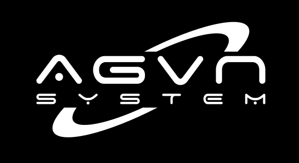

# A-GVN | Automated Governing System

## Backend

This dir contains the core backend service - data logic.

## Containers and Hosting

**TODO** -> build the entire backend as a single docker container image. On each release/patch, rebuild the image. Then can upload to docker hub. And host it on kubernetes/azure containers.

Hosted as a single machine. All the server endpoints use that image's config values. On cloud implmentation like azure, could be spread out in order to balance load, which should be mostly quite low for user access.

The problem is mainly online learning, data gathering and crawling and compute (reconfiguring the main and submodel weights continuously). This means its prob better to use a compute platform rather than a generic devops/container/webserver platform.

### Running

On the Azure VM, the image should start the core webserver and load the models into memory. It should also load any in memory persistent data like redis data.

I want to try out NGINX but idk how it would apply here. It would make sense if we had several apps/server instances running on the image. Or be running it on the infrastructure itself. I think Azure would have it handled mostly.

`cargo run` should be sufficient, and most things should be self contained within the rust code. Any external function calls from rust -> python can simply use `pyo3`.
