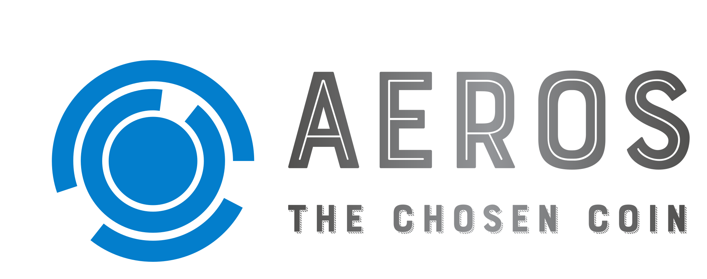

## Aeros

Aeros is the complete software suite that lets nodes process and manage gcoin.

## GCoin
Gcoin semi-public cryptocurrency which is very stable, pegged at a flat rate to AUD.
NOTE: insitutions and individuals are responsible for managing exchange rates, the algorithm simply selects nodes to become validators.

An embedded server updates every hour to view GCoin-AUD conversions by taking into account inflation and confidence.

## Proof of Contribution
Idea: nodes are incenvitised to do the right thing since they are staking their own reputation and money.
The probabiltiy of becoming a validator is as follows:
$$
\text{Pr}(\text{elected validator}) = k_1\text{total contribution} + k_2\text{contribution growth} + k_3\text{staked gcoin} + k_4 
$$

## DCP
DCP (Dat Copy) uses the 'Dat' protocol to implement remote file copy.
It uses npm by default but can be installed [here](https://github.com/tom-james-watson/dat-cp).

This module uses [`p2p-send.sh`](p2p-send.sh) which wraps around DCP to send messages to connected peers.

## Peer-To-Peer : DNS and Discovery
In order for the p2p blockchain to work, a public dns list of nodes will be queried by a new node.

#### DNS Seeds
DNS seeds are DNS servers containing an archive of IP addresses that assist in peer discovery. By using dynamic DNS, the peers stored may be mroe reliable.

DNS seeds usually have a IP crawler that attempts to contact IPs to check whether specific pots are open, e.g. 8333 for Bitcoin.

#### GCoin Standards and Assumptions
The port for GCoin is on 25907, so if you're IP address is listening and broadcasting on this port, it can be added to the global DNS.
Other users may also choose to add an IP address.

For the purposes of this project, assume that such DNS list exists and works.

## Exchange Rates
Factors that influence exchange rates:

- Interest rates (local and foreign)
- Growth rate
- Competitiveness
- Confidence
- Relative inflation

## Extensions

- create UI in the theme of AGVN black/white.
- Implement Blocks, The central blockchain, and an individual's wallet containing multiple public-private key pairs.
