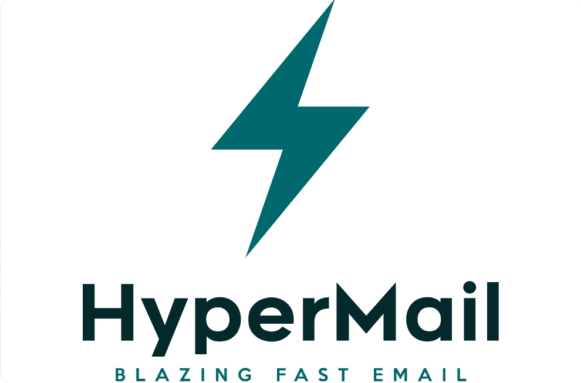

## HyperMail

An minimalist expressJS email server that delivers core email functionality to all users registered on AGVN.
Mostly decoupled from the main server, as a separate microservice. Can and should be run on another server and domain.

- uses npm (node.js) dynamic server and a key-value database. Could be optimised for persistency in meemory (redis)

**TODO**: split this up as a different repo
